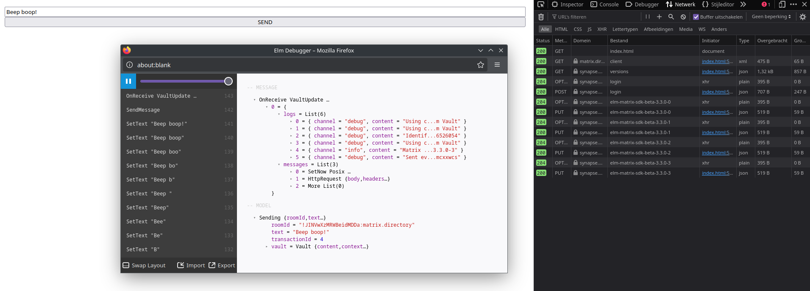

# Elm SDK beta 3.3.0

This repository shows a simple demonstration of the Elm SDK at
[beta version 3.3.0](https://package.elm-lang.org/packages/noordstar/elm-matrix-sdk-beta/3.3.0/).
This version is the first beta version that offers API interactions in the form
of sending message events.

You can view in the **Network** session of your browser how the Elm SDK
interacts with your Matrix homeserver, and there's a little blue box in the
bottom right of the page that shows you every interaction that is happening on
the webpage. It even has a time machine, so you can go back through the page
and see what's happening!

Use this to learn about the Elm SDK, to evaluate its quality and to check it
out. Maybe it'll teach you a thing or two when interacting with another SDK!

I have not put an open source license on this, but feel free to do with the
source code in this(!) repository whatever you want. It is meant as a learning
tool and I don't need financial support to throw this out there. :)
